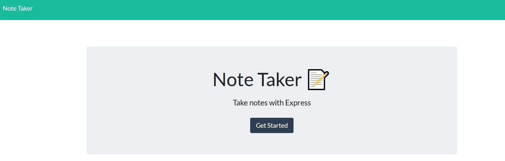
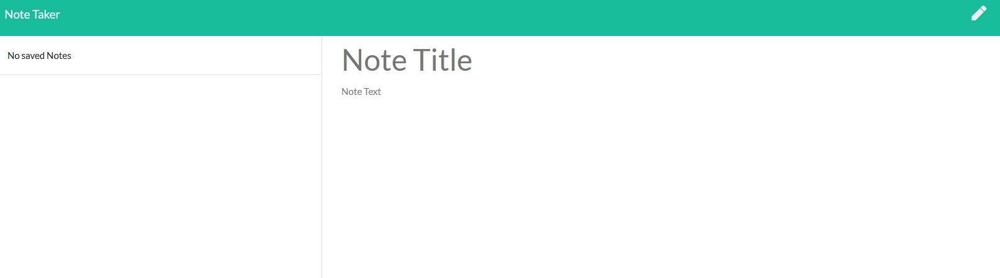
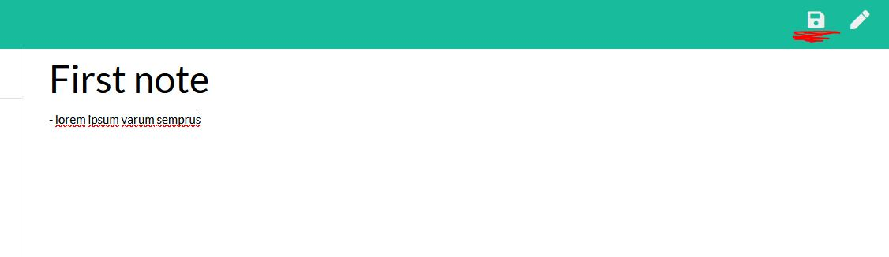
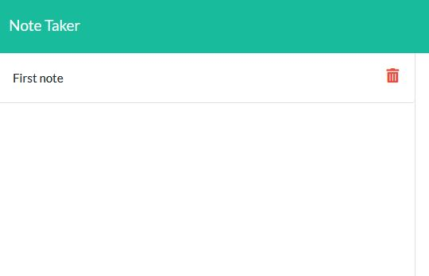
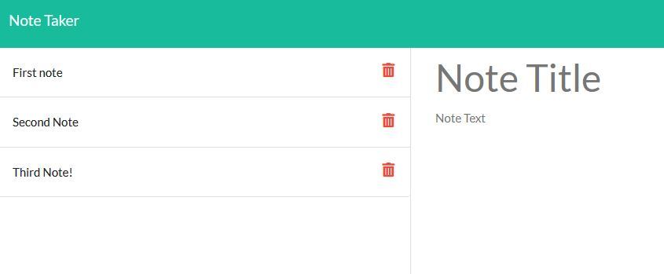
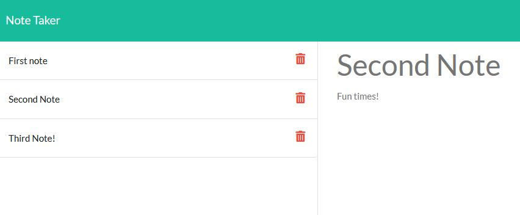
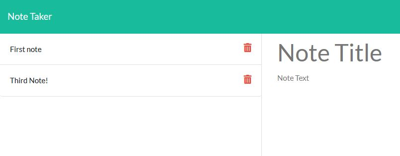

# Note Taker

<br />

## Description

Note taking application that can be used to write, save, and delete notes. This application uses an express backend to save and retrieve note data from a JSON file.

## Contents

- [Installation](#installation)
- [User Story](#user-story)
- [Usage](#usage)
- [Demonstration](#demonstration)
- [Tests](#Tests)
- [Screenshots](#screenshots)
- [Questions](<#questions-(FAQ)>)
- [Contact](#contact)
- [Author](#authors)
- [Acknowledgements](#acknowledgements)

## Installation

#### To modify:

1. Clone repository

2. Run npm i for dependencies

```
  npm i
```

## User Story

```
As a user
I want to keep flexible notes
So that I have to what I wanted to remember easily and in one place
```

## Usage

Ensure the following are correctly installed (if you have node already, make sure version is up to date):

- [Node.js](https://nodejs.org/en/)

Run npm install for the npm package dependencies before attempting to run locally.

Otherwise, this app is hosted on the [Heroku](https://www.heroku.com) service.

## Demonstration

- [Deployed Application](https://radiant-sea-94722.herokuapp.com/)

## Tests

- No included tests for this application.

## Screenshots

_Landing page to get started_



_Default notes page without any notes_



_Option to save reveals itself when text is applied_



_Notes save in the sidebar_



_Many notes can be saved_



_You can click on previous notes to open them_



_You can click the bin icon to remove notes_



## Questions

- Submit questions to my contact details below.
- App is hosted by Heroku.

## Contact

- Contact me with any questions on my email: agre.fun21@gmail.com or silver.grech@gmail.com

## Author

- Initial files to develop by Trilogy Education Services
- Andr&eacute; Grech - 3/11/2020

### Acknowledgements

- © 2019 Trilogy Education Services, a 2U, Inc. brand. All Rights Reserved.
